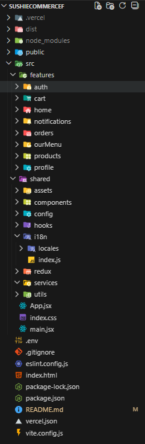

# 📘 Sushi Ecommerce – Frontend 🍣

Ecommerce web application built with React, focused on clean architecture, authentication, user notifications, and modern best practices.

## 🚀 Live Demo

👉 https://sushi-ecommerce-f.vercel.app

---

## 🧠 Features

This frontend implementation includes:

### 🧑‍💻 Authentication
- Users can register and login securely  
- Token handling with protected routes

### 🧾 User Profile
- View and edit user profile data  
- Purchase history (if applicable)

### 🔔 Notification System
- Server-driven notifications  
- Mark notifications as read  
- Auto-refresh of profile data upon change

### 🌐 Internationalization
- English 🇬🇧 / Spanish 🇪🇸 toggle with i18next

### 📱 Responsive UI
- Works smoothly on mobile, tablet, and desktop

### 🎨 Dark / Light Mode
- Theme switch with smooth transitions

### ⚡ Optimistic UI with React Query
- Fast UI updates while data mutates  
- Automatic cache invalidation & refetching

---

## 🛠️ Tech Stack

| Layer                    | Technologies                          |
| ------------------------ | ------------------------------------- |
| UI                       | React + Vite                          |
| Routing                  | React Router                          |
| Global Client State      | Redux Toolkit                         |
| Server State / Caching   | React Query                           |
| HTTP Client              | Axios                                 |
| Styling                  | Tailwind CSS                          |
| Internationalization     | i18next                               |
| Notifications            | Sonner (toasts)                       |

---

## 🧩 Architecture & Folder Structure

The project uses a **feature-based folder structure** to keep implementations isolated, organized, and maintainable:

  

---

## 📌 Implementation Highlights

### 🔒 Authentication Flow
- JWT-based login & protected routes  
- React Query used to fetch authenticated profile data  
- Conditional rendering based on auth state

---

### 🛍️ Cart Management
- Cart accessible to both guests and authenticated users  
  - Guests → cart stored in `localStorage`  
  - Authenticated → cart stored and persisted in backend  
- Merge logic on login for a unified UX

---

### 🍽️ Our Menu View
- Category list → click to show filtered products  
- Breadcrumb UI for hierarchical navigation  
- Sidebar cart always visible during browsing

---

## 🧠 State Management Strategy

- **Redux Toolkit** is used for global client-side state (UI, preferences, app-level flags).
- **React Query** is used for server state (API data, caching, mutations).
- This separation avoids overusing Redux for async data and keeps the architecture clean and scalable.

---

### 💸 Checkout Experience
- Stripe integration for payments (frontend handles redirect via session)  
- Discounts supported via gift card logic (25% off)  
- Backend webhook handles order finalization  
- Purchase saved to user history upon confirmation

---

## 📦 Libraries & Integrations

| Purpose                 | Library                          |
| ----------------------- | -------------------------------- |
| Global State Management | Redux Toolkit                    |
| Async State / Caching   | React Query                      |
| Form Handling           | react-hook-form                  |
| HTTP                    | Axios                            |
| Routing                 | React Router                     |
| Internationalization    | i18next                          |
| Notifications / Toasts  | Sonner                           |
| Styling                 | Tailwind CSS                     |

---

## 🧪 Dev Experience & Best Practices

- 🧩 Feature-based structure for modularity and scalability  
- 🚫 No duplication between layers — separation of concerns  
- 🧠 Service layer isolates API calls from UI  
- 📊 React Query for caching, background refetching and mutations  
- 🪝 Custom hooks for composable logic  
- 🎨 Shared components for UI consistency  
- 🌍 Internationalization ready (EN/ES)

---

## 🧠 Notifications UX

- Notifications driven by backend events  
- Notifications are marked as read  
- React Query auto-refreshes profile data  
- Translations integrated for notification messages

---
## 🙌 Acknowledgments

Built as part of a full-stack challenge integrating:

- ✅ Authentication

- ✅ Cart management

- ✅ Stripe checkout

- ✅ React Query cache strategy

- ✅ Internationalization & UI state

- ✅ Modular & maintainable architecture

---

## 📬 Contact

- LinkedIn: [Facundo Robert](https://www.linkedin.com/in/robertfacundodev/)
- Portfolio: [My Portfolio](https://facundorobert.vercel.app/) 
- Email: robertf.coder@gmail.com